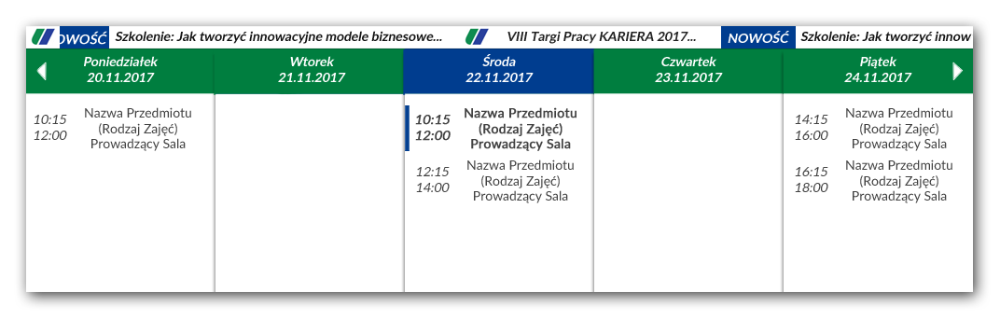

# ZUTSchedule
ZUTSchedule is an application that downloads schedule from Universities system and display it in the clean way.

  

Development of this application is recorded at my blog [kkolodziejczak.net](http://kkolodziejczak.net).
Blog is written in Polish so feel free to use google translate.

## Download
The application is not finished yet. As soon as it is finished, a download link will be added.

## Used resources
- [Lato](http://www.latofonts.com/lato-free-fonts/#download) - Main font
- [FontAwsome](http://fontawesome.io/) - Font used for buttons
- [MaterialPalette](https://www.materialpalette.com/) - Color scheme for application
- [MaterialUI](https://www.materialui.co/) - Additional colors

## License
Archivist is distributed under the GPL-3.0 License.

## Feedback
All bugs, feature requests, pull requests, feedback, are welcome. [Create an issue](https://github.com/kkolodziejczak/ZUTSchedule/issues).